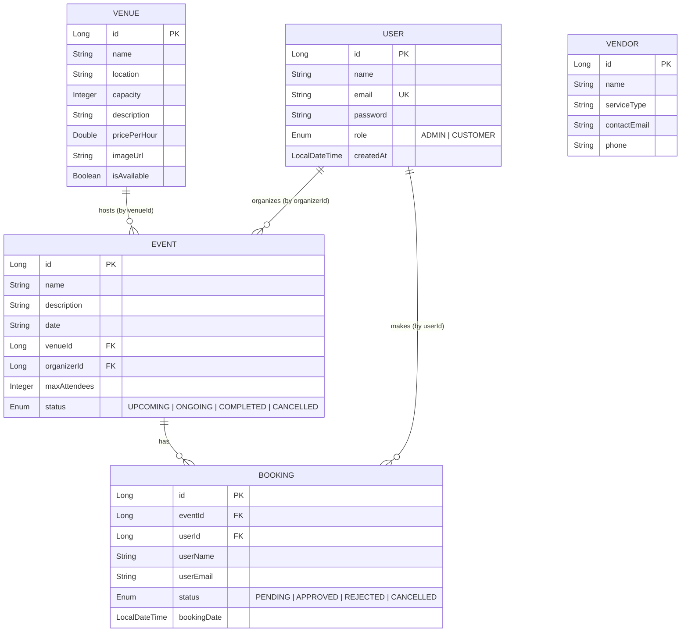

# EventZen - ER Diagram

## Database Architecture

EventZen uses a microservices architecture with **3 independent databases** (H2 in-memory for development):

- `usersdb` — User & Auth Service
- `venuesdb` — Venue & Vendor Service
- `eventsdb` — Event & Booking Service

---

## ER Diagram (Mermaid)

---

## Table Details

### usersdb.users

| Column      | Type         | Constraints       |
|-------------|-------------|-------------------|
| id          | BIGINT       | PK, AUTO_INCREMENT |
| name        | VARCHAR(255) | NOT NULL          |
| email       | VARCHAR(255) | NOT NULL, UNIQUE  |
| password    | VARCHAR(255) | NOT NULL          |
| role        | VARCHAR(20)  | ADMIN / CUSTOMER  |
| created_at  | TIMESTAMP    | DEFAULT NOW()     |

### venuesdb.venues

| Column         | Type         | Constraints       |
|---------------|-------------|-------------------|
| id            | BIGINT       | PK, AUTO_INCREMENT |
| name          | VARCHAR(255) | NOT NULL          |
| location      | VARCHAR(255) |                   |
| capacity      | INTEGER      |                   |
| description   | TEXT         |                   |
| price_per_hour| DOUBLE       |                   |
| image_url     | VARCHAR(500) |                   |
| is_available  | BOOLEAN      | DEFAULT TRUE      |

### venuesdb.vendors

| Column        | Type         | Constraints       |
|--------------|-------------|-------------------|
| id           | BIGINT       | PK, AUTO_INCREMENT |
| name         | VARCHAR(255) | NOT NULL          |
| service_type | VARCHAR(255) |                   |
| contact_email| VARCHAR(255) |                   |
| phone        | VARCHAR(50)  |                   |

### eventsdb.events

| Column        | Type         | Constraints           |
|--------------|-------------|----------------------|
| id           | BIGINT       | PK, AUTO_INCREMENT    |
| name         | VARCHAR(255) | NOT NULL              |
| description  | TEXT         |                       |
| date         | VARCHAR(255) |                       |
| venue_id     | BIGINT       | Reference to venues   |
| organizer_id | BIGINT       | Reference to users    |
| max_attendees| INTEGER      |                       |
| status       | VARCHAR(20)  | UPCOMING/ONGOING/COMPLETED/CANCELLED |

### eventsdb.bookings

| Column       | Type         | Constraints           |
|-------------|-------------|----------------------|
| id          | BIGINT       | PK, AUTO_INCREMENT    |
| event_id    | BIGINT       | Reference to events   |
| user_id     | BIGINT       | Reference to users    |
| user_name   | VARCHAR(255) |                       |
| user_email  | VARCHAR(255) |                       |
| status      | VARCHAR(20)  | PENDING/APPROVED/REJECTED/CANCELLED |
| booking_date| TIMESTAMP    | DEFAULT NOW()         |
