# EventZen - User Flow Document

## 1. Customer Journey

### 1.1 Registration & Login

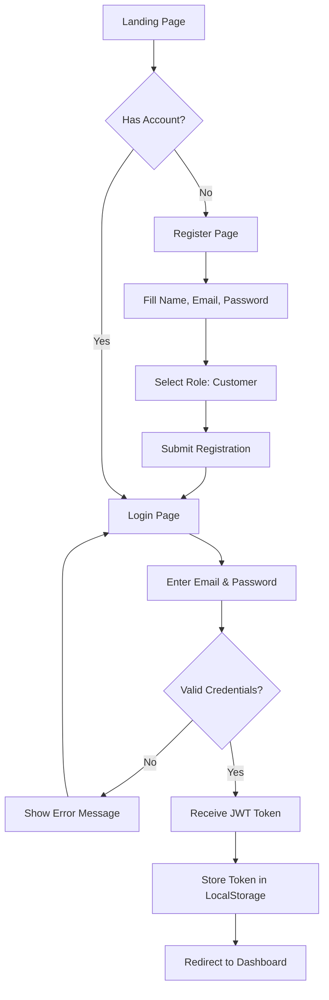

### 1.2 Browse & Book Events

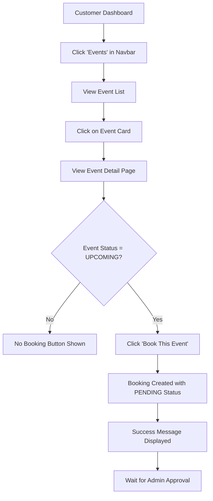

### 1.3 Manage Bookings

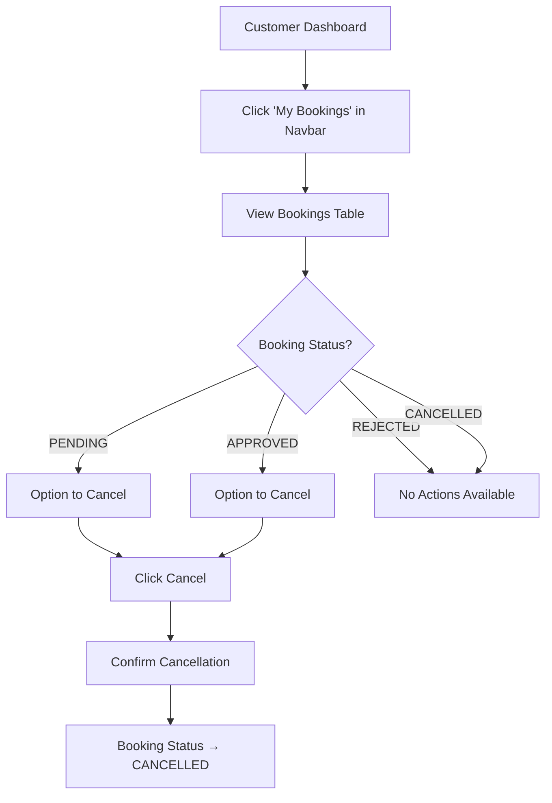

### 1.4 Browse Venues

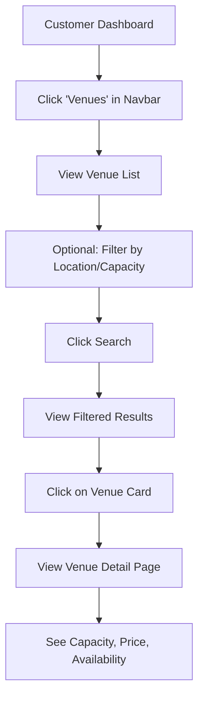

---

## 2. Admin Journey

### 2.1 Admin Login

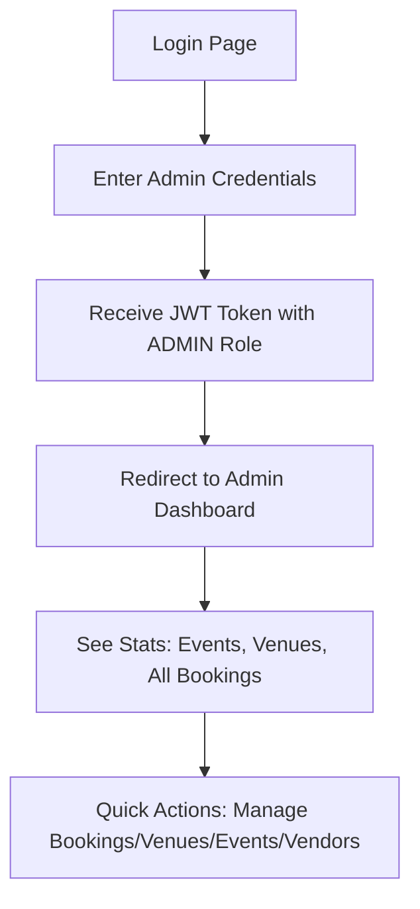

### 2.2 Manage Bookings (Approve/Reject)

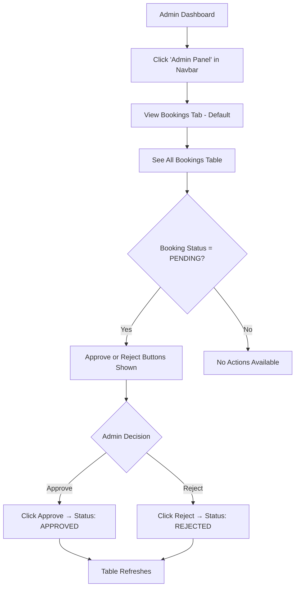

### 2.3 Manage Venues (CRUD)

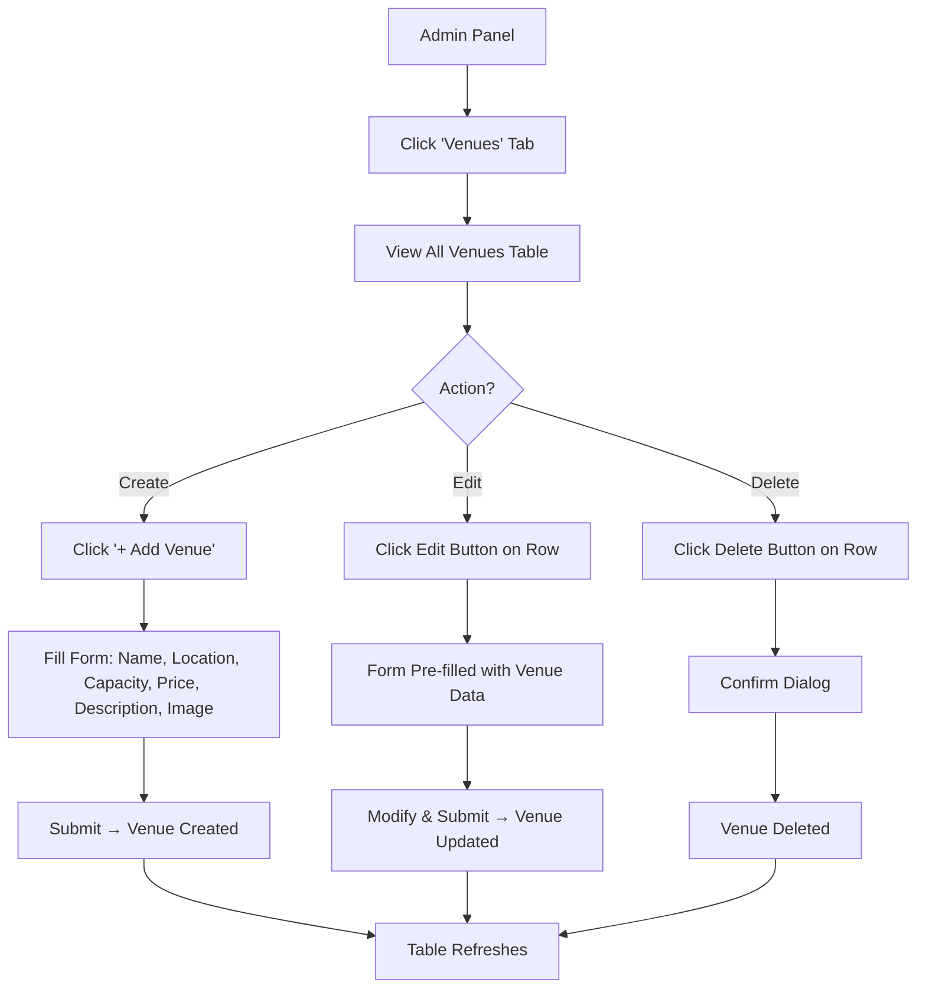

### 2.4 Manage Events (CRUD)

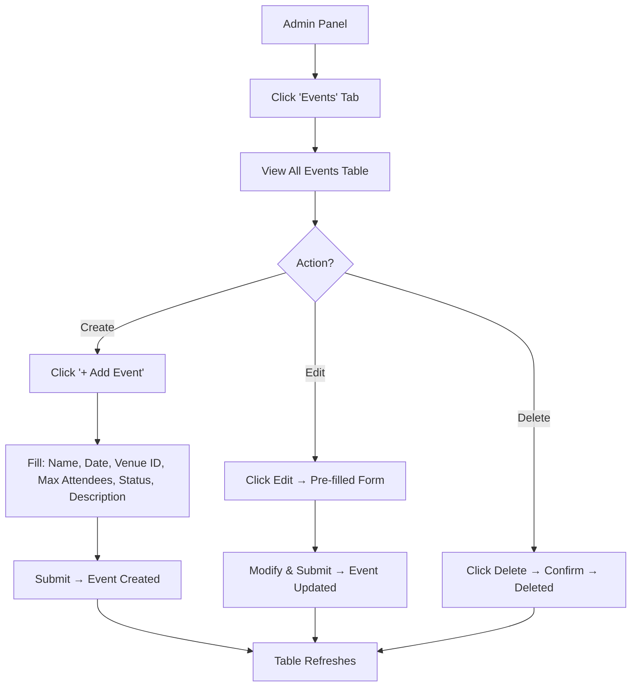

### 2.5 Manage Vendors (CRUD)

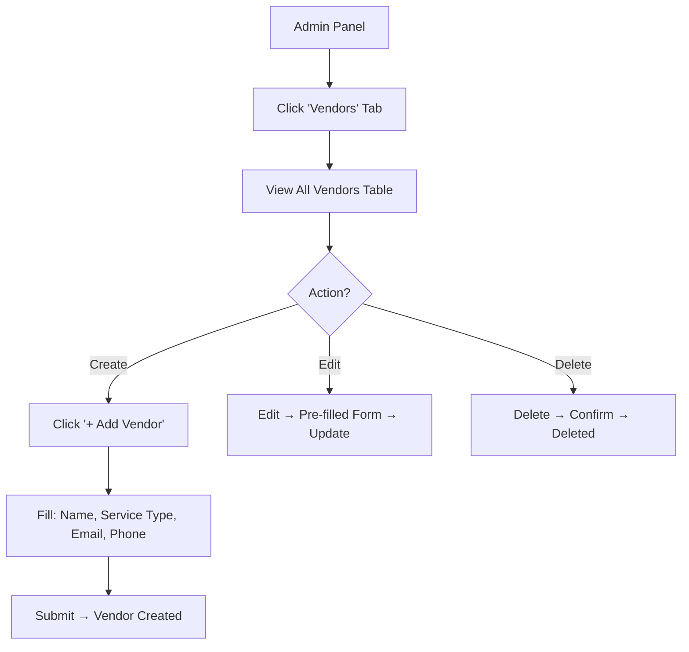

---

## 3. Complete System Flow

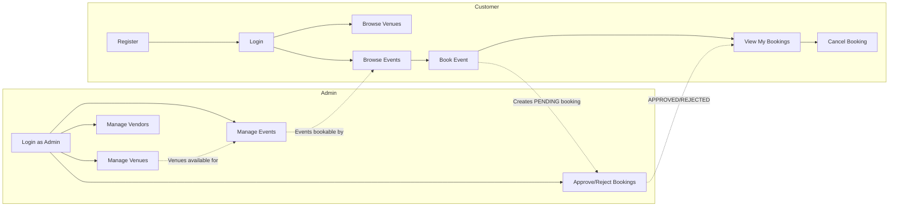

---

## 4. Authentication Flow

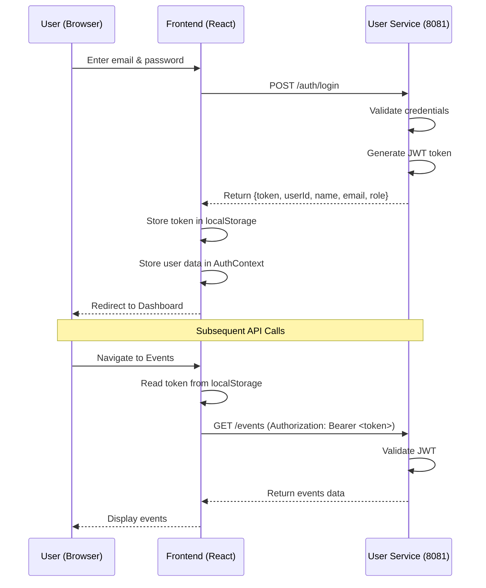
